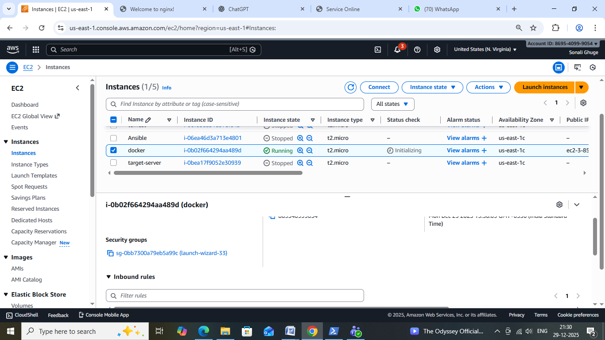

# Nginx-deployment-on-docker
### Dockerized Nginx App on AWS EC2

A simple DevOps project demonstrating deployment of a Dockerized static web application using Nginx on an AWS EC2 instance.

### Project Overview

This project showcases how a static HTML/CSS web application can be containerized using Docker and served through the Nginx web server.
The Docker container is deployed on an AWS EC2 instance and accessed publicly using the EC2 public IP with port mapping.

### Technologies Used

- AWS EC2
- Docker
- Nginx
- HTML & CSS
- Amazon Linux
- Git & GitHub

### Dockerfile Description

- Uses the official Nginx base image

- Copies custom static web files to Nginx’s default web directory

- Exposes port 80 to serve the application

- Runs Nginx in the foreground to keep the container alive

### Deployment Steps

### 1. Launch EC2 Instance
- Instance type: t2.micro
- OS: Amazon Linux
- Open ports:22 (SSH)
- Custom application port (example: 32770)

### 2. Install Docker on EC2

sudo yum update -y
sudo yum install docker -y
sudo systemctl start docker
sudo systemctl enable docker
sudo usermod -aG docker ec2-user

### 3. Build Docker Image

docker build -t nginx-app .

### 4. Run Docker Container

docker run -d -p 32770:80 nginx-app

### Access the Application

http://:32770

Example:
http://3.85.129.254:32770

### Output

Application deployed successfully using Nginx
Docker container is LIVE & HEALTHY
Hosted on AWS EC2
Accessible via public IP

### Screenshots Included

- EC2 instance running state

- Apache HTTPD Default Page Verification

- Application running in browser

### Key Learnings
- Docker installation and setup
- Writing Dockerfiles
- Building Docker images
- Running containers with port mapping
- Deploying containerized applications on AWS EC2
- Using Nginx as a web server inside Docker

### Future Enhancements

- Docker Compose setup
- CI/CD pipeline using Jenkins
- HTTPS configuration
- Deployment using AWS ECS

### Author

Sonali Ghuge

GitHub: https://github.com/iamSonaliGhuge

